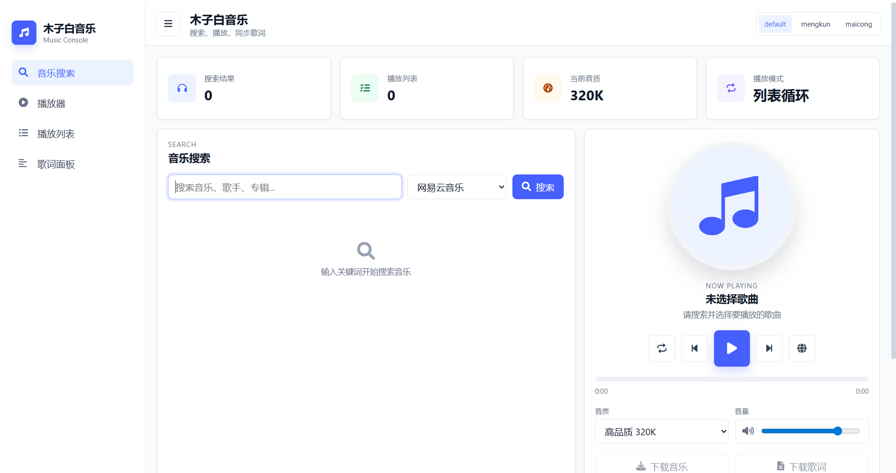
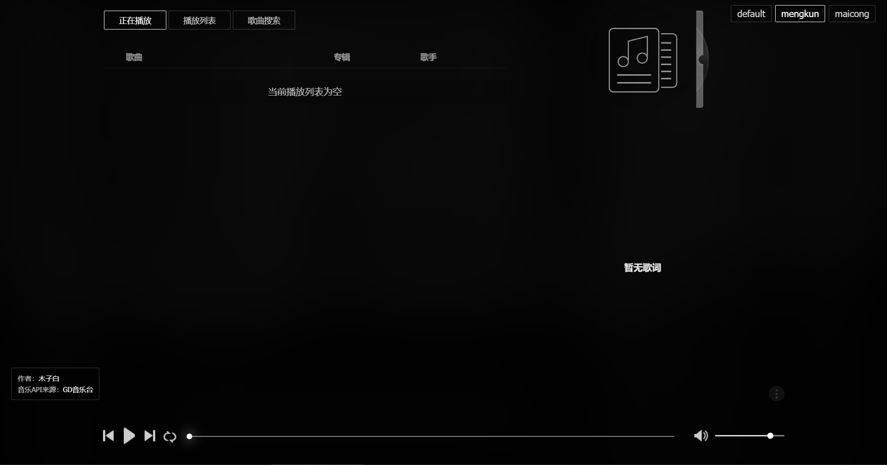
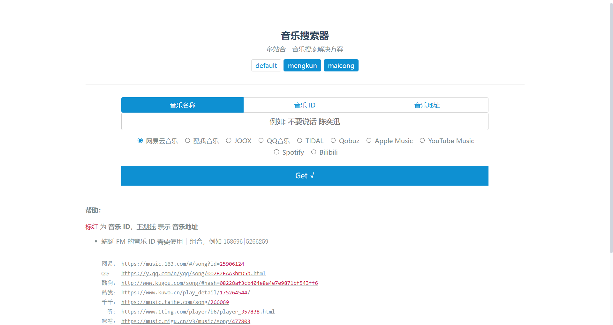

# 木子白音乐

一个单页多模板音乐搜索与播放器项目。页面支持多站音乐搜索、播放列表、歌词显示、音质切换、播放进度控制和模板切换，接口来源为 GD 音乐台。

## 界面截图

| default | mengkun | maicong |
| --- | --- | --- |
|  |  |  |

## 功能

- 多站音乐搜索：网易云音乐、酷我音乐、JOOX、QQ 音乐、TIDAL、Qobuz、Apple Music、YouTube Music、Spotify、Bilibili。
- 音乐播放：支持播放、暂停、上一首、下一首、进度跳转、播放模式切换。
- 播放列表：支持搜索结果加入播放列表，并保留本地播放状态。
- 歌词面板：支持歌词展示、当前歌词高亮和字号调节。
- 音质切换：支持 128K、192K、320K、FLAC、Hi-Res 等选项，具体可用性取决于接口返回。
- 三套界面模板：`default`、`mengkun`、`maicong`。
- 本地缓存：使用 `localforage` 与压缩存储保存播放列表、播放模式、模板选择等状态。

## 模板说明

- `default`：现代化默认模板，适合桌面和移动端通用使用。
- `mengkun`：移植自 MKOnlineMusicPlayer 的界面风格。
- `maicong`：移植自 music-1.7.7 的界面风格。

模板资源位于：

```text
assets/templates/
├─ mengkun/
└─ maicong/
```

## 目录结构

```text
.
├─ index.html                  # 页面入口
├─ manifest.json               # PWA 基础配置
├─ css/
│  └─ style.css                # 三套模板与响应式样式
├─ js/
│  └─ app.js                   # Vue 应用逻辑、搜索、播放、歌词、缓存
├─ assets/
│  ├─ templates/               # 模板图片资源
│  └─ vendor/                  # 本地第三方依赖
├─ docs/
│  └─ images/                  # README 截图
├─ data.js                     # 旧入口兼容文件
├─ index.js                    # 旧入口兼容文件
└─ vue.js                      # 旧入口兼容文件
```

`data.js`、`index.js`、`vue.js` 用于兼容旧缓存或旧入口引用，避免浏览器仍请求旧文件时出现空白页或控制台报错。

## 本地运行

项目为静态页面，放入 Web 服务目录后即可访问。例如当前环境可直接访问：

```text
http://localhost/
```

如果需要临时启动本地服务，可在项目根目录执行：

```bash
python -m http.server 8765
```

然后访问：

```text
http://localhost:8765/
```

## 接口来源

音乐 API 来源：[GD 音乐台](https://music.gdstudio.xyz)

当前程序中使用的接口入口：

```text
https://music-api.gdstudio.xyz/api.php
```

## 依赖

项目依赖文件已本地化到 `assets/vendor/`：

- Vue
- pako
- localforage

页面图标样式使用 Font Awesome CDN。如需完全离线运行，可将 Font Awesome 也下载到本地并修改 `index.html` 中的引用。

## 维护说明

- 修改页面结构：编辑 `index.html`。
- 修改模板样式：编辑 `css/style.css`。
- 修改搜索、播放、歌词、缓存逻辑：编辑 `js/app.js`。
- 更新 README 截图：替换 `docs/images/default.png`、`docs/images/mengkun.png`、`docs/images/maicong.png`。

## 作者与声明

作者：[木子白](https://github.com/hnlyzxf)

音乐 API 来源：[GD 音乐台](https://music.gdstudio.xyz)

本项目仅用于学习与个人使用，音乐数据与资源版权归原权利方所有。
